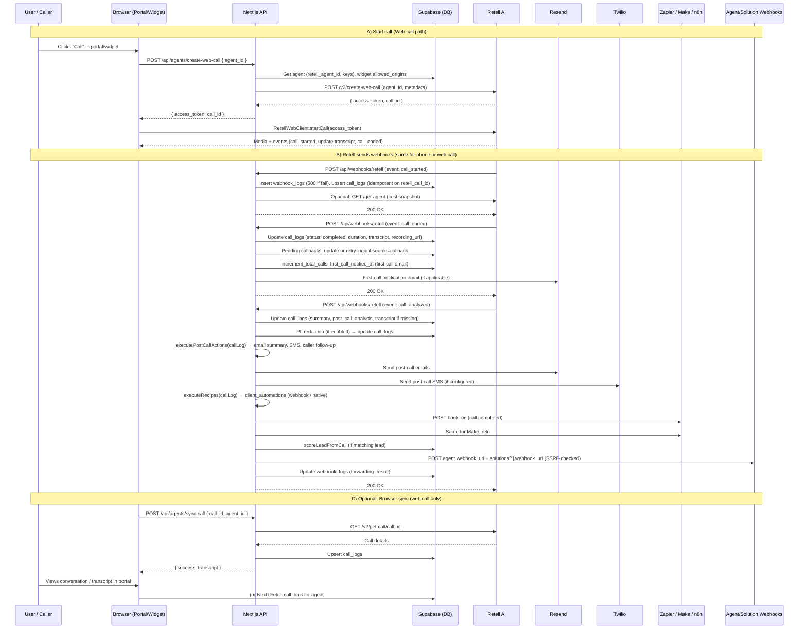
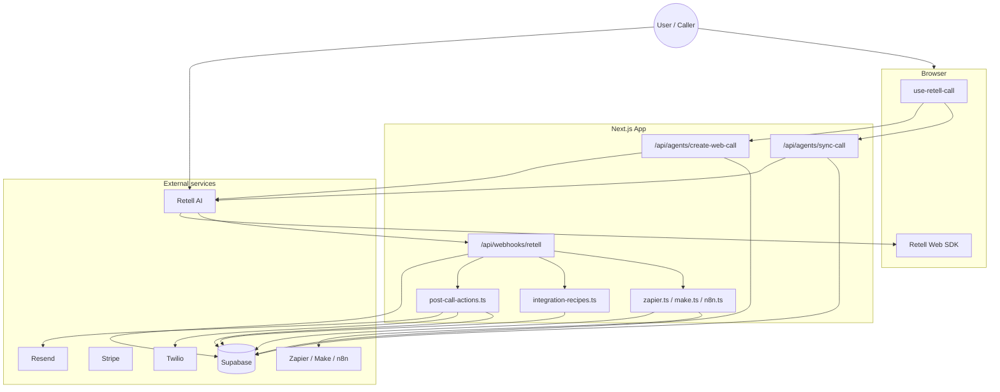

# Invaria Labs — System Map

This document maps the entire codebase: what each file does, what it talks to, what external services it uses, and how a single phone call flows through the system from start to finish.

---

## 1. High-Level Architecture

- **Stack**: Next.js 16 (App Router), React 19, TypeScript, Supabase (auth + Postgres), Retell AI (voice agents).
- **Audiences**: (1) **Startup** (internal dashboard: agents, clients, billing, settings). (2) **Portal** (client-facing: `/ slug /portal` — agents, knowledge base, calls, billing). (3) **Marketing** (public site: pricing, features, industries, contact, demo).
- **Call flow**: Calls are created via **Retell** (web or phone). Retell runs the AI conversation and sends **webhooks** to this app (`/api/webhooks/retell`). The app persists call logs, runs post-call actions, automations, Zapier/Make/n8n, and optional outbound webhooks.

---

## 2. External Services

| Service | Purpose | Used By (examples) |
|--------|---------|--------------------|
| **Retell AI** | Voice AI agents: create web/phone calls, get agent/call data, publish agents. Webhooks: call_started, call_ended, call_analyzed. | `lib/retell.ts`, webhook route, create-web-call, demo-call, sync-call, publish, config, onboarding test-call |
| **Supabase** | Auth (cookies/session), Postgres DB (RLS), service role for server-only writes. | All server code via `lib/supabase/server.ts` or `client.ts`, middleware |
| **Stripe** | Billing: Connect accounts, products, checkout, webhooks (invoice paid, etc.). | `lib/stripe.ts`, checkout/marketing-checkout routes, webhooks/stripe, billing pages |
| **Twilio** | SMS: send messages (post-call SMS, onboarding test SMS). | `lib/twilio.ts`, post-call-actions, onboarding test-sms |
| **Resend** | Transactional email (summaries, first-call notification, caller follow-up). | `lib/resend.ts`, `lib/email.ts`, post-call-actions, Retell webhook handler |
| **Zapier** | Event dispatch (e.g. call.completed) to subscribed hook URLs. | `lib/zapier.ts`, webhooks/retell |
| **Make (Integromat)** | Same as Zapier: dispatch call.completed to Make hooks. | `lib/make.ts`, webhooks/retell |
| **n8n** | Same: dispatch call.completed to n8n webhook URLs. | `lib/n8n.ts`, webhooks/retell |
| **Google / Slack / HubSpot / Notion / etc.** | OAuth integrations for agent tools (calendar, sheets, CRM, etc.). | `lib/oauth/*`, API tools under `/api/tools/*`, register-agent-tools |
| **Sentry** | Error monitoring (client/server/edge). | `instrumentation.ts`, sentry.*.config.ts |

---

## 3. File Map (What It Does, What It Talks To, External Services)

### 3.1 Core call path (phone call journey)

| File | What it does | Talks to | External |
|------|--------------|----------|----------|
| **`src/app/api/webhooks/retell/route.ts`** | Receives Retell webhooks (call_started, call_ended, call_analyzed). Verifies signature, writes webhook_logs (returns 500 if first insert fails), upserts call_logs (idempotent on retell_call_id for call_started), runs PII redaction, post-call actions, recipes, Zapier/Make/n8n, lead scoring (phone sanitized via sanitizePhone before lookup), first-call email, forwards to agent/solution webhook URLs. | `createServiceClient`, `executePostCallActions`, `executeRecipes`, `dispatchZapierEvent`, `dispatchMakeEvent`, `dispatchN8nEvent`, `sendEmail`, `scoreLeadFromCall`, `redactTranscript`/`redactText`, `isSafeWebhookUrl`, `sanitizePhone`, Retell SDK verify, `retellWebhookSchema`, logger | **Retell** (get-agent for cost snapshot), **Supabase**, **Resend**, **Zapier/Make/n8n** (and configured webhook URLs) |
| **`src/app/api/agents/create-web-call/route.ts`** | Public, rate-limited. Creates a Retell web call by agent_id; returns access_token + call_id for the Retell Web SDK. Validates origin via widget_config allowed_origins. | `createClient`, `decrypt`, `getIntegrationKey`, `rate-limit`, `RETELL_API_BASE` | **Retell** (v2/create-web-call), **Supabase** |
| **`src/app/api/agents/sync-call/route.ts`** | Auth required. Given call_id + agent_id, fetches call from Retell API and upserts into call_logs (for portal-initiated web calls so UI has transcript/analysis quickly). | `requireAuth`, `decrypt`, `getIntegrationKey`, `createServiceClient`, `RETELL_API_BASE` | **Retell** (v2/get-call), **Supabase** |
| **`src/hooks/use-retell-call.ts`** | Client hook: startCall(agentId) → POST create-web-call → Retell Web SDK startCall(accessToken); on call_ended calls sync-call (immediate + 3s delay). Manages isCallActive, transcript, mute. | `mergeTranscript` (transcript-utils); fetch `/api/agents/create-web-call`, `/api/agents/sync-call`; `retell-client-js-sdk` | **Retell** (via SDK + our API) |
| **`src/lib/post-call-actions.ts`** | Runs after call_analyzed: loads enabled post_call_actions (email_summary, sms_notification, caller_followup_email), builds content, sends via Resend or Twilio or schedules in scheduled_emails. | `createServiceClient`, `sendSms`, `sendEmail`, `notificationFrom`, `noReplyFrom` | **Supabase**, **Resend**, **Twilio** |
| **`src/lib/integration-recipes.ts`** | Runs after call_analyzed: loads client_automations + recipes, executes native (OAuth) or webhook/email; validates every webhook URL with isSafeWebhookUrl before fetch (skips recipe and logs on failure); logs to automation_logs, increments trigger_count/error_count. | `createServiceClient`, `executeNativeRecipe`, `isSafeWebhookUrl`, logger | **Supabase**, **OAuth providers** / **webhook URLs** (SSRF-safe) |
| **`src/lib/zapier.ts`** | Dispatches event (e.g. call.completed) to active zapier_subscriptions hook_urls; deactivates on 410. | `createServiceClient` | **Supabase**, **Zapier** (POST to hook_url) |
| **`src/lib/make.ts`** | Same pattern as Zapier for Make.com hook URLs. | `createServiceClient` | **Supabase**, **Make** |
| **`src/lib/n8n.ts`** | Same for n8n webhook URLs. | `createServiceClient` | **Supabase**, **n8n** |
| **`src/lib/retell.ts`** | Exports RETELL_API_BASE (env or https://api.retellai.com). | — | — |
| **`src/lib/schemas/retell-webhook.ts`** | Zod schema for Retell webhook payload validation. | — | — |

### 3.2 Auth, DB, and API helpers

| File | What it does | Talks to | External |
|------|--------------|----------|----------|
| **`src/lib/supabase/server.ts`** | createClient() — cookie-based server Supabase client; createServiceClient() — service role for server-only DB. | Next cookies, @supabase/ssr, @supabase/supabase-js | **Supabase** |
| **`src/lib/supabase/client.ts`** | Browser Supabase client for client components. | @supabase/ssr | **Supabase** |
| **`src/lib/supabase/middleware.ts`** | updateSession: refresh auth, enforce public vs protected routes, redirect client users to /slug/portal and startup users to /dashboard, validate portal slug. | NextRequest/NextResponse, Supabase | **Supabase** |
| **`src/proxy.ts`** | Next.js middleware entry: exports proxy() that calls updateSession; matcher excludes static assets. | updateSession (lib/supabase/middleware) | — |
| **`src/lib/api/auth.ts`** | requireAuth(): get Supabase user; return 401 if not logged in. | createClient (server) | **Supabase** |
| **`src/lib/api/get-client-id.ts`** | Resolve client_id from request (e.g. portal slug or auth). | Supabase | **Supabase** |
| **`src/lib/api/require-role.ts`** | Require specific org/role for admin routes. | auth, Supabase | **Supabase** |
| **`src/lib/api/verify-tool-auth.ts`** | Verifies tool-call auth (API key + client existence) for Retell custom tools hitting our API; used by all tool routes under `/api/tools/*`. | get-client-id, crypto | **Supabase** |
| **`src/lib/crypto.ts`** | Encrypt/decrypt (e.g. stored Retell API keys). | env (encryption key) | — |
| **`src/lib/rate-limit.ts`** | In-memory rate limiters (e.g. publicEndpointLimiter, per-phone for demo). | — | — |
| **`src/lib/url-validation.ts`** | isSafeWebhookUrl (SSRF protection for outbound webhooks). | — | — |
| **`src/lib/logger.ts`** | Structured logger. | — | — |

### 3.3 Billing, Stripe, Twilio, Email

| File | What it does | Talks to | External |
|------|--------------|----------|----------|
| **`src/lib/stripe.ts`** | Stripe SDK wrapper: Connect accounts, products, checkout, invoices, portal, webhook verification. | env STRIPE_SECRET_KEY | **Stripe** |
| **`src/lib/twilio.ts`** | getTwilioClient(), sendSms(to, body). | env TWILIO_*, logger | **Twilio** |
| **`src/lib/resend.ts`** | sendEmail({ to, subject, html, from }). | env RESEND_API_KEY, email (noReplyFrom) | **Resend** |
| **`src/lib/email.ts`** | notificationFrom(), noReplyFrom() for sender addresses. | — | — |
| **`src/app/api/webhooks/stripe/route.ts`** | Stripe webhook handler: constructEvent, handle subscription/invoice events, update DB. | stripe, createServiceClient | **Stripe**, **Supabase** |

### 3.4 Agent config, Retell API, tools

| File | What it does | Talks to | External |
|------|--------------|----------|----------|
| **`src/lib/compile-flow-to-retell.ts`** | Compiles FlowNode[] to Retell LLM states + general_tools; filters custom tools by public URL; used when creating/updating Retell agent config. | conversation-flow-templates | — |
| **`src/lib/oauth/register-agent-tools.ts`** | Registers agent tool URLs with Retell (custom tools point to this app’s /api/tools/*). | compile-flow-to-retell, integrations, RETELL_API_BASE | **Retell**, **Supabase** |
| **`src/lib/prompt-generator.ts`** | Builds system prompts / LLM config from agent + knowledge base. | Supabase, conversation-flow-templates, compile-flow-to-retell | **Supabase** |
| **`src/app/api/agents/[id]/config/route.ts`** | GET: return agent config for UI. PATCH: update agent (and optionally push to Retell: create/update agent, register tools). | requireAuth, decrypt, getIntegrationKey, compile-flow-to-retell, register-agent-tools, prompt-generator, RETELL_API_BASE | **Retell**, **Supabase** |
| **`src/app/api/agents/[id]/publish/route.ts`** | POST: call Retell publish-agent. | requireAuth, decrypt, getIntegrationKey, RETELL_API_BASE | **Retell**, **Supabase** |
| **`src/app/api/agents/[id]/voices/route.ts`** | List Retell voices. | requireAuth, RETELL_API_BASE | **Retell** |
| **`src/app/api/demo-call/route.ts`** | Public, rate-limited. Creates outbound **phone** call via Retell create-phone-call for marketing demo (industry + phone). | rate-limit, RETELL_API_BASE, logger | **Retell** |
| **`src/app/api/calls/route.ts`** | GET: list call_logs (auth). POST: create_web_call (public, rate-limited) by retell agent_id — alternate to create-web-call. | requireAuth, createClient, getIntegrationKey, rate-limit, RETELL_API_BASE | **Retell**, **Supabase** |

### 3.5 Other API routes (concise)

- **Auth**: `api/auth/route.ts` (login/session), `api/auth/reset-password/route.ts`, `app/auth/callback/route.ts` (OAuth callback).
- **Agents**: `api/agents/route.ts` (CRUD), `api/agents/[id]/route.ts`, `api/agents/[id]/knowledge-base/route.ts`, `api/agents/[id]/conversation-flow/route.ts`, `api/agents/[id]/chat/route.ts` (chat completion), `api/agents/[id]/call-handling/route.ts`, `api/agents/[id]/widget-config/route.ts`, `api/agents/[id]/versions/route.ts`, `api/agents/[id]/ai-analysis/route.ts`, `api/agents/[id]/topics/route.ts`, `api/agents/[id]/campaign-config/route.ts`, `api/agents/[id]/webhook-test/route.ts` — all use **Supabase**; many use **Retell** for config/voices.
- **Clients**: `api/clients/route.ts`, `api/clients/[id]/route.ts`, `api/clients/[id]/assigned-agents/route.ts`, `api/clients/[id]/client-access/route.ts`, `api/clients/[id]/embed-url/route.ts`, `api/clients/[id]/members/route.ts`, `api/clients/[id]/solutions/route.ts` — **Supabase**.
- **Calls**: see above (calls, create-web-call, sync-call).
- **Knowledge base**: `api/knowledge-base/route.ts`, hours, locations, policies, faqs, services — **Supabase**.
- **Business settings**: `api/business-settings/route.ts`, policies, faqs, locations, hours, services — **Supabase**.
- **Conversation flows**: `api/conversation-flows/route.ts`, `[id]/route.ts` — **Supabase**, **compile-flow-to-retell**.
- **Post-call actions**: `api/post-call-actions/route.ts` — **Supabase**.
- **Leads / campaigns**: `api/leads/route.ts`, `[id]/route.ts`, `[id]/score/route.ts`, `api/campaigns/route.ts` — **Supabase**; lead scoring uses **Supabase**.
- **Phone numbers**: `api/phone-numbers/route.ts`, purchase, search, assign, caller-id, import — **Supabase**, **Twilio** (purchase), **Retell** (caller-id).
- **SIP trunks**: `api/sip-trunks/route.ts`, `[id]/route.ts` — **Supabase**.
- **Billing / checkout**: `api/billing/route.ts`, `api/checkout/route.ts`, `api/marketing-checkout/route.ts`, `api/client/billing/route.ts`, `api/client/plan-access/route.ts` — **Supabase**, **Stripe**.
- **Integrations**: `api/integrations/route.ts`, configure, client, recipes, recent-syncs, webhook-test, service-mappings, integration-requests — **Supabase**, **OAuth**.
- **OAuth**: `api/oauth/authorize/route.ts`, callback, disconnect, connections, google/calendars, google/sheets, slack/channels — **Supabase**, **Google/Slack/etc**.
- **Zapier / Make / n8n**: `api/zapier/auth/route.ts`, subscribe (validates hookUrl with isSafeWebhookUrl before storing; 400 if unsafe); `api/make/auth/route.ts`, subscribe (same); `api/n8n/auth/route.ts`, subscribe (same) — **Supabase**, **Zapier/Make/n8n**.
- **Health**: `api/health/route.ts` — returns `{ status: "ok" }` only (no Supabase or backend details).
- **Cron**: daily-digest, checkin-email, send-emails, process-callbacks, usage-alerts, retry-queue — **Supabase**, **Resend**, **Retell** (process-callbacks for callbacks).
- **Admin**: org-settings, plans, pricing-tables, stripe-connections — **Supabase**, **Stripe**.
- **Tools (Retell custom tools)**: `api/tools/*` — all routes use `verifyToolAuth` (API key + client existence). Calendar, calendly, availability, transfer, escalate, sms/send, email/send, faq/search, policies/search, services/search, locations/nearest, hubspot/lookup, salesforce/lookup, gohighlevel/lookup, housecallpro/*, jobber/*, appointments, intake/collect, feedback/collect, notes/create, leads/create|update, waitlist/add, callback, confirmation/send, business-hours/check — **Supabase**, **Google/Twilio/HubSpot/etc** as needed.
- **Webhooks**: `api/webhooks/retell/route.ts`, `api/webhooks/stripe/route.ts`, `api/webhooks/resend/inbound/route.ts`, jobber, housecallpro — **Supabase** and respective services.

### 3.6 App pages (concise)

- **Auth**: login, signup, setup-account, forgot-password, reset-password — forms + Supabase auth.
- **Marketing**: layout, page (home), pricing, features, about, contact, industries, privacy, terms — static/marketing content; contact and demo-call hit API.
- **Portal** (`[clientSlug]/portal`): layout, page (dashboard), onboarding, agents/[id] (widget, conversations, analytics, knowledge-base, call-handling, post-call-actions, campaigns, leads, topics, agent-settings, ai-analysis, prompt-tree), conversation-flows, automations, integrations, billing, knowledge-base, error — **Supabase**; widget uses **use-retell-call** → **create-web-call** + **sync-call**.
- **Startup**: layout, dashboard, agents (list + [id]: overview, agent-config, prompt-tree, widget, campaigns, ai-analysis), clients (list + [id]: overview, assigned-agents, phone-numbers, etc.), settings (integrations, members, usage, webhook-logs, whitelabel, phone-sip, startup), billing (connect, subscriptions, invoices, products, coupons, transactions), saas (plans, pricing-tables, templates, connect, advanced), workflows, integrations, error — **Supabase**, **Stripe**; agent config/publish use **Retell**.

### 3.7 Components (concise)

- **UI**: button, input, card, dialog, table, tabs, etc. — generic UI only.
- **Layout**: startup-sidebar, portal-sidebar, tab-nav — nav + links.
- **Portal**: feature-gate, upgrade-banner, dashboard-theme-provider, zapier/n8n/make connection cards, recent-syncs-widget, chat-widget, service-mapping-editor — **Supabase**, plan-access.
- **Agents**: prototype-call-dialog, prompt-tree-*, agent-test-panel — **create-web-call** or config APIs, Retell Web SDK.
- **Knowledge-base**: business-info-form, call-handling-settings, post-call-actions, action-email-summary, action-sms-notification, action-webhook, action-caller-followup, action-daily-digest, faqs-list, policies-list, locations-list, services-list, hours-editor, pii-redaction-settings, *-modal — **Supabase** (API or client).
- **Onboarding**: onboarding-provider, wizard-progress, conversation-flow-editor, test-call-*, test-chat-inline, quick-fix-modal, onboarding-tutorial — **Supabase**, onboarding API, test-call.
- **Marketing**: navbar, footer, hero, live-demo (demo-call), cta-section, faq-section, industries-grid, etc. — **demo-call** API for live demo.
- **Auth**: change-password — **Supabase**.
- **Billing**: stripe-connect-card — **Stripe**.
- **Integrations**: recipe-card, recipe-setup-modal, active-automation-card, recipe-editor, webhook-config, oauth-connect-button, resource-pickers (Google calendar, sheets, Slack) — **Supabase**, OAuth, integrations API.

### 3.8 Hooks, types, instrumentation

| File | What it does | Talks to | External |
|------|--------------|----------|----------|
| **`src/hooks/use-retell-call.ts`** | See call path above. | create-web-call, sync-call, transcript-utils | **Retell** (via API + SDK) |
| **`src/hooks/use-onboarding.ts`** | Onboarding state (steps, status). | onboarding API | **Supabase** |
| **`src/hooks/use-plan-access.ts`** | Plan/feature access for portal. | plan-access, client API | **Supabase** |
| **`src/types/database.ts`** | DB types (generated or hand-maintained). | — | — |
| **`src/types/retell.ts`** | Retell-related types. | — | — |
| **`src/types/index.ts`** | Re-exports types. | — | — |
| **`src/instrumentation.ts`** | Next.js instrumentation (e.g. Sentry). | — | **Sentry** |

### 3.9 Remaining lib files (concise)

- **`lib/integrations.ts`**: getIntegrationKey(org_id, provider) — **Supabase**.
- **`lib/plan-access.ts`**: Client plan/feature checks — **Supabase**.
- **`lib/lead-scoring.ts`**: scoreLeadFromCall — **Supabase**.
- **`lib/pii-redaction.ts`**: redactTranscript, redactText — config from **Supabase** (used in webhook).
- **`lib/url-validation.ts`**: isSafeWebhookUrl — used by webhook handler (agent/solution URLs), integration-recipes (webhook/email recipe URLs), and Zapier/Make/n8n subscribe routes (hookUrl before store).
- **`lib/utils.ts`**: sanitizePhone (digits and + only) — used in Retell webhook before lead lookup.
- **`lib/transcript-utils.ts`**, **`lib/transcript-extraction.ts`**: Merge/parse transcript — used by UI and tools.
- **`lib/conversation-flow-templates.ts`**: Flow templates — used by compile-flow-to-retell, UI.
- **`lib/knowledge-base-generator.ts`**: Build KB content for agents — **Supabase**.
- **`lib/retell-costs.ts`**: Cost/usage from Retell — **Retell**, **Supabase**.
- **`lib/oauth/state.ts`**, **`lib/oauth/token-manager.ts`**: OAuth state and token storage — **Supabase**.
- **`lib/oauth/execute-native.ts`**: Execute native automation recipes (Slack, HubSpot, etc.) — **Supabase**, **Slack/HubSpot/etc**.
- **`lib/oauth/providers.ts`**: OAuth provider config.
- **`lib/oauth/executors/*.ts`**: Per-provider (Slack, Google Sheets, Twilio SMS, HubSpot, Notion, QuickBooks, Salesforce, GoHighLevel, Jobber, HousecallPro) — **Supabase** + respective APIs.
- **`lib/integration-events.ts`**, **`lib/integration-retry.ts`**: Event dispatch and retry — **Supabase**.
- **`lib/service-mapper.ts`**: Map external service names to internal — used by integrations.
- **`lib/callback-utils.ts`**: Pending callbacks (e.g. “we’ll call you back”) — **Supabase**, **Retell** (create-phone-call in cron).
- **`lib/automation-recipes.ts`**, **lib/prompt-templates.ts** — **Supabase** / config.

---

## 4. Full Journey of a Single Phone Call (Start to Finish)

Two main entry points for a “call”:

1. **Inbound phone call**: Caller dials a number that routes to Retell. Retell runs the agent and sends webhooks to this app. This app does **not** originate the call; it only receives events.
2. **Web call (browser)**: User clicks “Call” in the portal/widget → app creates a web call via Retell → browser uses Retell Web SDK → when call ends, **both** the frontend (sync-call) and Retell (webhooks) can write/update call_logs.

The diagram below shows the **unified path** once Retell has an active call: Retell sends webhooks to our API; we persist state and run all post-call logic. For web calls, the “user interaction” is “click Call” → create-web-call → SDK; the rest matches the webhook-driven flow.

### Step-by-step (single phone call)

1. **Call starts (phone or web)**  
   - **Phone**: Carrier → Retell (number configured in Retell).  
   - **Web**: User in portal/widget → `useRetellCall.startCall(agentId)` → `POST /api/agents/create-web-call` → Retell `v2/create-web-call` → browser RetellWebClient connects.

2. **Retell sends `call_started`**  
   - `POST /api/webhooks/retell` → verify signature → resolve agent → insert `webhook_logs` (return 500 if insert fails) → upsert `call_logs` (idempotent on `retell_call_id`, status `in_progress`). Optionally fetch Retell agent config for cost snapshot.

3. **Call in progress**  
   - Retell runs the conversation (and may call our `/api/tools/*` for custom tools). No further webhooks until end.

4. **Retell sends `call_ended`**  
   - Same webhook URL → update `call_logs` (status `completed`, duration, transcript, recording_url). Handle pending_callbacks (retry/fail). Increment total_calls; if first real call since go-live, send first-call email via Resend.

5. **Retell sends `call_analyzed`**  
   - Update `call_logs` (summary, post_call_analysis). Apply PII redaction if enabled. Then:
   - **Post-call actions**: email summary, SMS notification, caller follow-up (Resend/Twilio/scheduled_emails).
   - **Automation recipes**: execute enabled client_automations (webhook or native OAuth); webhook URLs validated with isSafeWebhookUrl before fetch (invalid URLs skip that recipe).
   - **Zapier / Make / n8n**: POST to subscribed hook_urls (stored only after isSafeWebhookUrl at subscribe) with call payload.
   - **Lead scoring**: if caller phone (sanitized: digits and + only) matches a lead, update lead score.
   - **Outbound webhooks**: POST to agent `webhook_url` and active solutions’ `webhook_url` (SSRF-validated).

6. **Web call only: frontend sync**  
   - On `call_ended`, `useRetellCall` calls `POST /api/agents/sync-call` (once immediately, once after 3s) so the UI can show transcript/analysis from our DB even before or in addition to webhook updates.

7. **User sees result**  
   - Portal conversations/analytics pages read `call_logs` (and related data) from Supabase or via Next API routes.

End-to-end: **User/Caller** → **Retell** (and optionally **Browser** for web) → **Next.js** (`/api/webhooks/retell`, create-web-call, sync-call) → **Supabase** (call_logs, webhook_logs, actions, recipes, leads) → **Resend / Twilio / Zapier / Make / n8n / custom webhooks** → back to **User** (emails, SMS, external automations, and UI showing call history).

---

## 5. Diagram: Data Flow Overview

---

*Generated for the Invaria Labs codebase. For the latest routes and files, refer to the repo structure and the sections above.*
